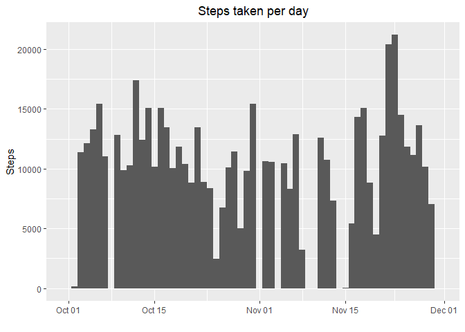
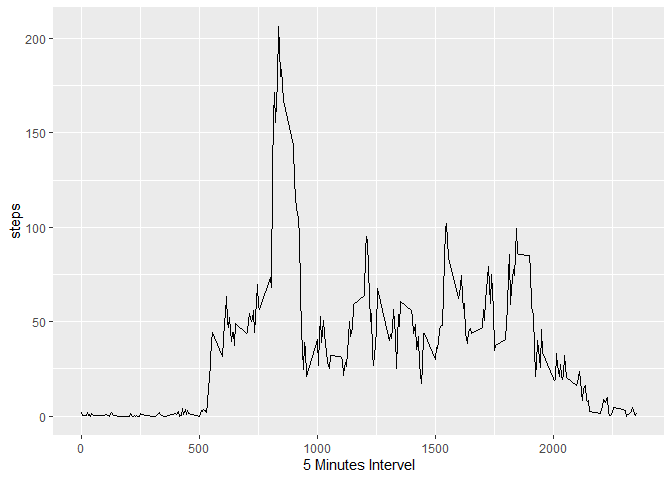
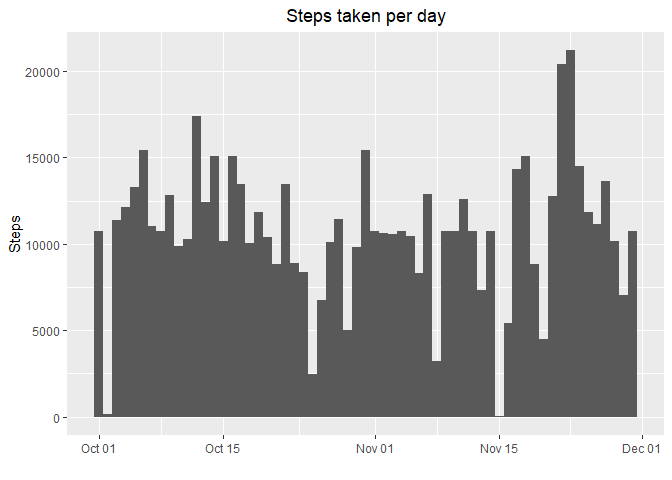
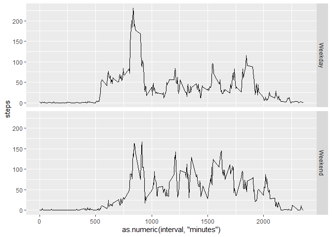

## Loading and preprocessing the data


``` r
library(tidyverse)
```

```
## ── Attaching core tidyverse packages ──────────────────────── tidyverse 2.0.0 ──
## ✔ dplyr     1.2.1     ✔ readr     2.2.0
## ✔ forcats   1.0.1     ✔ stringr   1.6.0
## ✔ ggplot2   4.0.3     ✔ tibble    3.3.1
## ✔ lubridate 1.9.5     ✔ tidyr     1.3.2
## ✔ purrr     1.2.2     
## ── Conflicts ────────────────────────────────────────── tidyverse_conflicts() ──
## ✖ dplyr::filter() masks stats::filter()
## ✖ dplyr::lag()    masks stats::lag()
## ℹ Use the conflicted package (<http://conflicted.r-lib.org/>) to force all conflicts to become errors
```

``` r
library(dplyr)
library(xtable)
data <- read.csv(unz("activity.zip","activity.csv"))
data <- mutate(data, date = ymd(date))
data <- group_by(data, by = day(date))
```

## Making histogram


``` r
library(ggplot2)
graph <- ggplot(data,aes(x = date, weight = steps))
graph + geom_histogram(binwidth = 1) + labs(title = "Steps taken per day", y = "Steps",
        x = "") + theme(plot.title = element_text(hjust = 0.5))
```

<!-- -->

## What is mean total number of steps taken per day?


``` r
library(xtable)
mean <- summarise(data, mean = mean(steps, na.rm = TRUE))
mean <- mutate(mean, median = summarise(data, median = median(steps, na.rm = TRUE))$median)
mean <- xtable(mean[,-1])
print(mean,type = "html")
```

<!-- html table generated in R 4.5.3 by xtable 1.8-8 package -->
<!-- Sat May 30 23:39:30 2026 -->
<table border=1>
<tr> <th>  </th> <th> mean </th> <th> median </th>  </tr>
  <tr> <td align="right"> 1 </td> <td align="right">  </td> <td align="right">  </td> </tr>
  <tr> <td align="right"> 2 </td> <td align="right"> 18.62 </td> <td align="right"> 0.00 </td> </tr>
  <tr> <td align="right"> 3 </td> <td align="right"> 38.06 </td> <td align="right"> 0.00 </td> </tr>
  <tr> <td align="right"> 4 </td> <td align="right"> 42.07 </td> <td align="right"> 0.00 </td> </tr>
  <tr> <td align="right"> 5 </td> <td align="right"> 41.20 </td> <td align="right"> 0.00 </td> </tr>
  <tr> <td align="right"> 6 </td> <td align="right"> 41.24 </td> <td align="right"> 0.00 </td> </tr>
  <tr> <td align="right"> 7 </td> <td align="right"> 41.49 </td> <td align="right"> 0.00 </td> </tr>
  <tr> <td align="right"> 8 </td> <td align="right"> 11.18 </td> <td align="right"> 0.00 </td> </tr>
  <tr> <td align="right"> 9 </td> <td align="right"> 44.48 </td> <td align="right"> 0.00 </td> </tr>
  <tr> <td align="right"> 10 </td> <td align="right"> 34.38 </td> <td align="right"> 0.00 </td> </tr>
  <tr> <td align="right"> 11 </td> <td align="right"> 39.78 </td> <td align="right"> 0.00 </td> </tr>
  <tr> <td align="right"> 12 </td> <td align="right"> 48.87 </td> <td align="right"> 0.00 </td> </tr>
  <tr> <td align="right"> 13 </td> <td align="right"> 34.31 </td> <td align="right"> 0.00 </td> </tr>
  <tr> <td align="right"> 14 </td> <td align="right"> 52.42 </td> <td align="right"> 0.00 </td> </tr>
  <tr> <td align="right"> 15 </td> <td align="right"> 17.67 </td> <td align="right"> 0.00 </td> </tr>
  <tr> <td align="right"> 16 </td> <td align="right"> 35.63 </td> <td align="right"> 0.00 </td> </tr>
  <tr> <td align="right"> 17 </td> <td align="right"> 48.25 </td> <td align="right"> 0.00 </td> </tr>
  <tr> <td align="right"> 18 </td> <td align="right"> 43.69 </td> <td align="right"> 0.00 </td> </tr>
  <tr> <td align="right"> 19 </td> <td align="right"> 35.89 </td> <td align="right"> 0.00 </td> </tr>
  <tr> <td align="right"> 20 </td> <td align="right"> 25.81 </td> <td align="right"> 0.00 </td> </tr>
  <tr> <td align="right"> 21 </td> <td align="right"> 37.51 </td> <td align="right"> 0.00 </td> </tr>
  <tr> <td align="right"> 22 </td> <td align="right"> 58.83 </td> <td align="right"> 0.00 </td> </tr>
  <tr> <td align="right"> 23 </td> <td align="right"> 52.28 </td> <td align="right"> 0.00 </td> </tr>
  <tr> <td align="right"> 24 </td> <td align="right"> 39.64 </td> <td align="right"> 0.00 </td> </tr>
  <tr> <td align="right"> 25 </td> <td align="right"> 24.87 </td> <td align="right"> 0.00 </td> </tr>
  <tr> <td align="right"> 26 </td> <td align="right"> 31.15 </td> <td align="right"> 0.00 </td> </tr>
  <tr> <td align="right"> 27 </td> <td align="right"> 41.26 </td> <td align="right"> 0.00 </td> </tr>
  <tr> <td align="right"> 28 </td> <td align="right"> 37.57 </td> <td align="right"> 0.00 </td> </tr>
  <tr> <td align="right"> 29 </td> <td align="right"> 20.95 </td> <td align="right"> 0.00 </td> </tr>
  <tr> <td align="right"> 30 </td> <td align="right"> 34.09 </td> <td align="right"> 0.00 </td> </tr>
  <tr> <td align="right"> 31 </td> <td align="right"> 53.52 </td> <td align="right"> 0.00 </td> </tr>
   </table>

## What is the average daily activity pattern?


``` r
data <- mutate(data, interval = minutes(interval))
new_data <- group_by(data, interval)
interval_mean <- summarise(new_data, steps = mean(steps, na.rm = TRUE))
line_plot <- ggplot(interval_mean, aes(x = minute(interval), y = steps))
line_plot + geom_line()  + labs(x = "5 Minutes Intervel")
```

<!-- -->

## Max no of steps taken on average across all days


``` r
max <- max(interval_mean$steps)
interval_mean[which(interval_mean$steps == max),]
```

```
## # A tibble: 1 × 2
##   interval steps
##   <Period> <dbl>
## 1 835M 0S   206.
```

## Calculating Missing values


``` r
mean(is.na(data$steps)) *100
```

```
## [1] 13.11475
```
There are 13.12% missing values in the data

## Imputing missing values


``` r
no_nas <- new_data %>% mutate(steps = replace_na(steps, as.integer(round(mean(steps, na.rm = TRUE)))))
```

Replacing the missing values by calculating the mean of steps taken daily in 5 minute interval


``` r
average <- no_nas %>% group_by(day(date))%>% summarise(mean = mean(steps))
average <- no_nas %>% group_by(day(date)) %>% summarise(median = median(steps)) %>% mutate(average,median = median)
average <- xtable(average[,-1])
print(average, type = "html")
```

<!-- html table generated in R 4.5.3 by xtable 1.8-8 package -->
<!-- Sat May 30 23:39:30 2026 -->
<table border=1>
<tr> <th>  </th> <th> median </th> <th> mean </th>  </tr>
  <tr> <td align="right"> 1 </td> <td align="right"> 34.50 </td> <td align="right"> 37.37 </td> </tr>
  <tr> <td align="right"> 2 </td> <td align="right"> 0.00 </td> <td align="right"> 18.62 </td> </tr>
  <tr> <td align="right"> 3 </td> <td align="right"> 0.00 </td> <td align="right"> 38.06 </td> </tr>
  <tr> <td align="right"> 4 </td> <td align="right"> 8.50 </td> <td align="right"> 39.72 </td> </tr>
  <tr> <td align="right"> 5 </td> <td align="right"> 0.00 </td> <td align="right"> 41.20 </td> </tr>
  <tr> <td align="right"> 6 </td> <td align="right"> 0.00 </td> <td align="right"> 41.24 </td> </tr>
  <tr> <td align="right"> 7 </td> <td align="right"> 0.00 </td> <td align="right"> 41.49 </td> </tr>
  <tr> <td align="right"> 8 </td> <td align="right"> 1.00 </td> <td align="right"> 24.27 </td> </tr>
  <tr> <td align="right"> 9 </td> <td align="right"> 7.50 </td> <td align="right"> 40.93 </td> </tr>
  <tr> <td align="right"> 10 </td> <td align="right"> 9.00 </td> <td align="right"> 35.87 </td> </tr>
  <tr> <td align="right"> 11 </td> <td align="right"> 0.00 </td> <td align="right"> 39.78 </td> </tr>
  <tr> <td align="right"> 12 </td> <td align="right"> 0.00 </td> <td align="right"> 48.87 </td> </tr>
  <tr> <td align="right"> 13 </td> <td align="right"> 0.00 </td> <td align="right"> 34.31 </td> </tr>
  <tr> <td align="right"> 14 </td> <td align="right"> 8.00 </td> <td align="right"> 44.90 </td> </tr>
  <tr> <td align="right"> 15 </td> <td align="right"> 0.00 </td> <td align="right"> 17.67 </td> </tr>
  <tr> <td align="right"> 16 </td> <td align="right"> 0.00 </td> <td align="right"> 35.63 </td> </tr>
  <tr> <td align="right"> 17 </td> <td align="right"> 0.00 </td> <td align="right"> 48.25 </td> </tr>
  <tr> <td align="right"> 18 </td> <td align="right"> 0.00 </td> <td align="right"> 43.69 </td> </tr>
  <tr> <td align="right"> 19 </td> <td align="right"> 0.00 </td> <td align="right"> 35.89 </td> </tr>
  <tr> <td align="right"> 20 </td> <td align="right"> 0.00 </td> <td align="right"> 25.81 </td> </tr>
  <tr> <td align="right"> 21 </td> <td align="right"> 0.00 </td> <td align="right"> 37.51 </td> </tr>
  <tr> <td align="right"> 22 </td> <td align="right"> 0.00 </td> <td align="right"> 58.83 </td> </tr>
  <tr> <td align="right"> 23 </td> <td align="right"> 0.00 </td> <td align="right"> 52.28 </td> </tr>
  <tr> <td align="right"> 24 </td> <td align="right"> 0.00 </td> <td align="right"> 39.64 </td> </tr>
  <tr> <td align="right"> 25 </td> <td align="right"> 0.00 </td> <td align="right"> 24.87 </td> </tr>
  <tr> <td align="right"> 26 </td> <td align="right"> 0.00 </td> <td align="right"> 31.15 </td> </tr>
  <tr> <td align="right"> 27 </td> <td align="right"> 0.00 </td> <td align="right"> 41.26 </td> </tr>
  <tr> <td align="right"> 28 </td> <td align="right"> 0.00 </td> <td align="right"> 37.57 </td> </tr>
  <tr> <td align="right"> 29 </td> <td align="right"> 0.00 </td> <td align="right"> 20.95 </td> </tr>
  <tr> <td align="right"> 30 </td> <td align="right"> 5.00 </td> <td align="right"> 35.73 </td> </tr>
  <tr> <td align="right"> 31 </td> <td align="right"> 0.00 </td> <td align="right"> 53.52 </td> </tr>
   </table>

## Creating Histpgram of total number of steps taken each day

``` r
graph <- ggplot(no_nas,aes(x = date, weight = steps))
graph + geom_histogram(binwidth = 1) + labs(title = "Steps taken per day", y = "Steps",
        x = "") + theme(plot.title = element_text(hjust = 0.5))
```

<!-- -->

## Are there differences in activity patterns between weekdays and weekends?

Grouping the data frame by weekday and interval and calculating the mean and
creating the line graph

``` r
by_week <- mutate(no_nas,
        day_type = if_else(weekdays(date) %in% c("Saturday", "Sunday"), "Weekend", "Weekday"),
        day_type = factor(day_type, levels = c("Weekday", "Weekend")))
by_week <- group_by(by_week, day_type, interval) %>% summarise(steps = mean(steps), .groups = "drop_last")
line_grap <- ggplot(by_week, aes(x = as.numeric(interval, "minutes"), y = steps, group = 1))
line_grap + geom_line() + facet_grid(by_week$day_type~.)
```

<!-- -->
